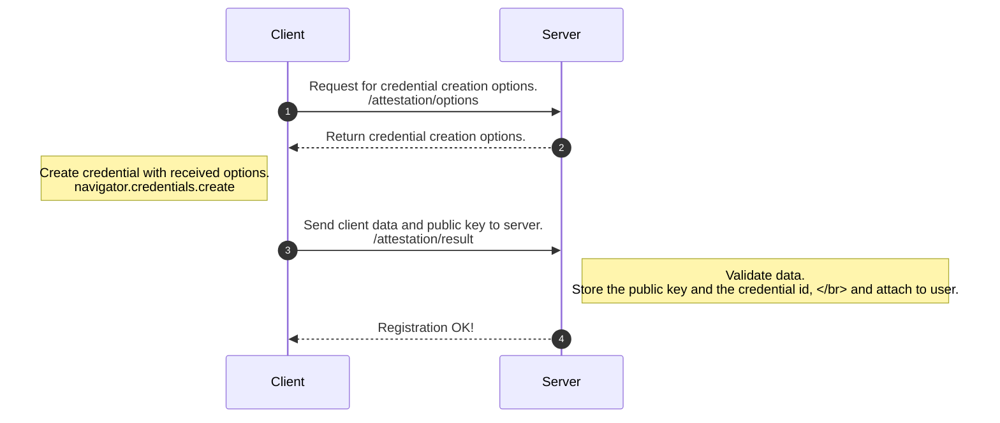
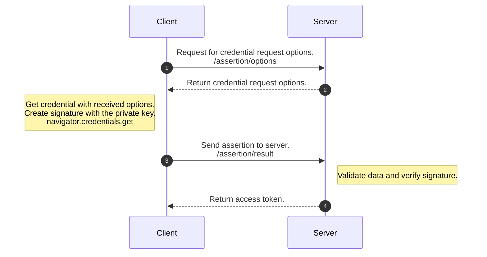

Passkeys and security keys have gained more and more popularity lately, and no wonder – they provide
much more security and usability than passwords. These authentication methods utilize strong and
phishing-resistant public key credentials that the keys or authenticators, as we call them,
can create automatically. However, implementing passwordless support in your web application,
or even replacing passwords altogether, might initially seem overwhelming.

## FIDO2 and WebAuthn Standards Ease the Job

Integrating the authenticators into your web application happens through common standards
created by [the FIDO alliance](https://fidoalliance.org/). It is good news for us
application developers: we don't have to care about the dirty details of each
authenticator implementation. Our job is to take into use the platform or browser APIs
that enable the creation and use of the authenticator-managed credential.
The operating system or browser handles needed user interaction and shows standard dialogs when appropriate.


<em>The team implements passwordless support by integrating credential handling into
the client application and the backend authentication service. Client applications
can use the platform WebAuthn capabilities through the native APIs or browser JavaScript implementation.
The backend service must support at least credential registration and credential-based user authentication.
</em>


Furthermore, we need to have a backend service in place that is capable of storing and verifying
these credentials so that the authentication can take place correctly. The service must support
[the W3C WebAuthn standard](https://www.w3.org/TR/webauthn/) so that the backend
API responses are compatible with the client-side authenticator logic.

## To Buy or To Build?

Choosing one of many authentication service providers may be the most straightforward path on your
passwordless journey. A service provider typically gives you access to a backend as
a SaaS or a product you host yourself. The backend has the above capabilities to store and verify
your users' public keys. In addition to backend functionality, the service providers offer
client libraries that enable you to add matching authenticator support to your application,
whether a web or a native application.


<em>Platform and browser handle the user interaction dialogs when using authenticators.</em>


Another option is to implement the WebAuthn support yourself. Some excellent [open-source libraries](https://github.com/herrjemand/awesome-webauthn)
already exist that ease the development of your backend service's functionality for
public key handling. [Browser support for WebAuthn capabilities](https://caniuse.com/webauthn) is
rather good, and the integration to the web application is straightforward
once the backend is in place. One can utilize dedicated
client libraries for native applications (for example, [iOS](https://developer.apple.com/documentation/authenticationservices/public-private_key_authentication)
and [Android](https://developer.android.com/training/sign-in/passkeys)).

## Example of Getting Hands Dirty

In our OSS decentralized identity agency project, we implemented WebAuthn logic ourselves.
We created the authentication functionality in our backend server and web application.
The core functionality consists of two features: registering a new user and authenticating
an existing user (and returning an access token after a successful authentication). Of course,
an end-product would have more features, e.g., for adding and removing authenticators
but starting with the core features is the simplest.

We wrote the authentication server in Go.
It utilizes [`go-webauthn`](https://github.com/go-webauthn/webauthn) library.
Both of the core features need two API endpoints.
On the client side, we use
the [navigator credentials JavaScript API](https://w3c.github.io/webappsec-credential-management/#framework-credential-management)
in a React application. The following sequence graphs demonstrate in more detail how the logic flows:

**Registration**

**Authentication**

For more information on how and which data is handled, see, for example, [the WebAuthn guide](https://webauthn.guide/#webauthn-api).
You can also find our [client application source codes](https://github.com/findy-network/findy-wallet-pwa/blob/master/src/components/WebauthnLogin.tsx)
and [the authentication service implementation](https://github.com/findy-network/findy-agent-auth/blob/master/main.go)
on GitHub.

As the example above shows, implementing a passwordless is not impossible.
However, as with any new technology, it takes time and dedication from the team
to familiarize themselves with the new logic and concepts. In addition,
as there are strict security requirements, testing the authentication flows
in a local development environment might be challenging at times, as the client and server
need to belong to the same domain. The local testing environment is something that the team
should resolve and enable together already early in the project so that it will not become a bottleneck.

## Not All Things Are Standardized

One might still find using an external authentication service provider a safer bet. Especially when
there is a need to support a variety of native devices, it may be tempting to pay someone to deal
with the device-specific problems. However, in this case, there is one essential thing to notice.

Usually, the service provider solutions are proprietary. It means that the interaction between
the client application and the backend API happens in a manner defined by the service provider.
Even though the WebAuthn requests and responses are standardized, the payload wrapper structures
and API endpoint paths depend on the implementation.
There exists [a FIDO recommendation](https://fidoalliance.org/specs/fido-v2.0-rd-20180702/fido-server-v2.0-rd-20180702.html#transport-binding-profile)
on how the server API should look like, but it is a mere recommendation and
not all service providers follow this guidance. Therefore, you cannot mix and match client
and server implementations but will likely end up in a vendor lock when choosing a proprietary solution.

*The path to passwordless is a journey that all web application developers will eventually travel.
Will your team take the steps sooner rather than later?*
