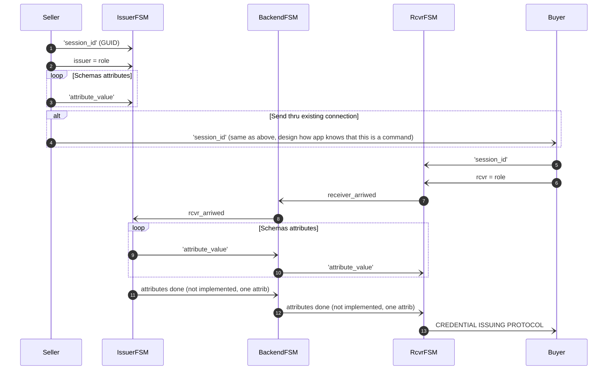

This post is a development story (or hands-on workshop) of how we can use an FSM
chatbot to implement SSI Services to allow any SSI/DID owner to be an issuer.
Let’s start with the result and see what the state machine looks like. As you
can see below, it’s simple, elegant, and, most importantly, easy to reason.


*Issuing Service Chatbot*
<br/><br/>

As you can see from the diagram there are two main paths. One for the `issuer` role
and one for the `rcvr` role. But the most interesting thing is that how simple the
machine is. As said, it's very easy to reason and understand. And that's the one of powers
these machines. The second one comes from the computational model of FSMs in
general, we could [proof that they're correct](https://www.academia.edu/3671180/FORMAL_VERIFICATION_OF_FINITE_STATE_MACHINES).

> Note that since our original FSM engine release we have extended our model
> with *transient state transitions or
> [pseudostates](https://www.site.uottawa.ca/~tcl/gradtheses/mnojoumian/ThesisFiles/FinalSpec/UML/15.3.8.html)*,
> but our UML renderer doesn't highlight them yet. We'll publish an other blog
> post with new features of our FSM engine later.

## What Problem Do We Solve?

The [Hyperledger Indy-based](https://hyperledger-indy.readthedocs.io/en/latest/)
SSI system is implemented with a CL signature scheme for ZKPs. That system needs
the concept of *Credential Definition* stored in its creator's wallet. The
Credential Definition has an ID, which is quite similar to DID in the Indy-based
AnonCreds system. The CredDefID is public. Everyone who knows it can request
proof based on it or request to present a proof based on it. 

But the CredDefID brings us some problems:
1. How do we find a correct CredDefID when it's needed?
1. How about fully symmetric cases when everyone can simultaneously be an
   issuer, a holder, and a verifier? Everyone can issue credentials and receive
   proof of them in these use cases. For example, we have a use case where a
   seller (anybody in a marketplace) wants to issue a receipt for the
   transaction.

There are other problems, but the rest are based on the same core problem.

We'll solve problem number 2 by using a notary-type service. We started with one
service and implemented a reference chatbot to issue credentials on behalf of a
logical issuer, aka seller. We also have implemented our version of a *public*
DID. With these two, we have solved the problem quite elegantly.

### Isn't This Centralization?

In some ways, yes, but the result isn't more centralized than the suggested
trust registries for other or similar problems in the SSI field. In a certain
way, this model adds self-sovereignty because now everyone can issue, and
everyone can build these issuing services for their use cases.

## More Reading

Before we continue, here's a list of
documents and places that are helpful when playing with these:

1. [Getting Started With SSI Service Agent Development](https://findy-network.github.io/blog/2023/01/30/getting-started-with-ssi-service-agent-development/)
1. [Writing SSI Apps](https://findy-network.github.io/blog/2023/02/06/how-to-equip-your-app-with-vc-superpowers/)
1. [FSM Documentation Part I](https://findy-network.github.io/blog/2023/03/13/no-code-ssi-chatbots-fsm-part-i/)
1. [FSM Documentation Part II](https://findy-network.github.io/blog/2023/06/22/beautiful-state-machines-fsm-part-ii/)
1. [The Workshop Material For Our CLI Tool](https://github.com/findy-network/agency-workshop/tree/master/track1-cli#task-0-setup-environment)

> Note that the blog post is written from self-learning material point of view.
> Preferably, you should read and execute the commands it guides you to do
> simultaneously.

## Prerequisites

Note, for now, we assume that the reader uses the local setup of the agency.
It makes it easier to follow the core agent's real-time logs.

Even though you have probably cloned the repo. But if not, please do it now:

```shell
git clone https://github.com/findy-network/findy-agent-cli
```

Follow the material in the repo's readme files or the workshop material
mentioned at the beginning to get your `findy-agent-cli` CLI tool working, i.e.,
communicating with your agency.

### Helpers

1. Go to repo's root:
1. Shorter name and autocompletion:
   ```shell
   alias cli=findy-agent-cli
   source ./scripts/sa-compl.sh
   ```

> Document for now on assumes that CLI tool is named to `cli`.

### Very Important

If you create new wallets directly with the CLI tool, make sure that auto-accept
mode is ON for the agent. The check it **after** the `cli agent ping` works:

```shell
cli agent mode-cmd -r
```

> Tip, if you have problems with CLI commands check your `FCLI_` prefixed envs.

The result should be AUTO_ACCEPT. Note that allocation scripts do this automatically.

> Chatbots work even when auto-accept isn't ON. They can written to make
> decisions to decline or acknowledge presented proofs, for example.

## Setup Agents And Wallets

It would be best to have at least three wallets and their agents up and running.
Inside the `findy-agent-cli` repo, you have `scrpits/fullstack` directory. Let's
name it a tool root for the rest of the documentation. For example:

```shell
export MY_ROOT=`pwd`
```

Follow the workshop documentation on how to allocate new agents with their
wallets.

Allocate the following agents (actual commands and the script calls follow):
1. `issuing` will be the issuing service
1. `seller`, will be a seller, aka logical issuer
1. `buyer` will be a buyer.
1. `verifier` will be a verifier for the VC. (Usage is out scoped from this document.)

Here's an example of how you could
1. allocate the agents,
1. have access to FSM files by making links,
1. create schema and credential definition (done in `issuing`),
1. create DIDComm connections between `issuing`, `seller`, and `buyer` *where
   the last is done in this phase just for testing the environment*. During the
   service integration (e.g. marketplace app) to the app invitation or command
   to connect with <SessionID> is sent in its own step during the service use.

```shell
cd "$MY_ROOT"
make-play-agent.sh issuing seller buyer verifier
cd play/issuing
ln -s ../../fsm/issuing-service-f-fsm.yaml
ln -s ../../fsm/issuing-service-b-fsm.yaml
open `cli bot uml issuing-service-f-fsm.yaml` # UML rendering
source ./new-schema
source ./new-cred-def
./invitation | ../seller/connect
./invitation | ../buyer/connect
```

Optionally store *a public DID* of the *Issuing Service Chatbot*:

```shell
export PUB_DID=$(./pub-did print)
```

> Note! Leave this terminal open and do not enter new commands to it yet.

> Note! `source ./new-cred-def` initializes `FCLI_CRED_DEF_ID` environment
> variable. The `issuing-service-f-fsm.yaml` file references to this variable,
> i.e. it's mandatory, *or* you could hard-code the *credential definition
> value* to your `issuing-service-f-fsm.yaml`.

## Use The Issuing Service

1. open 2 separated terminals `A` and `B` (see the workshop material on how to init
   envs) to work as a `seller`, leave them to be.
1. open 2 separated terminals `A` and `B` (see the workshop material on how to init
   envs) to work as a `buyer`, leave them to be.
1. go back to the previous `issuing` terminal and start the chatbot:
   ```shell
   cli bot start --service-fsm issuing-service-b-fsm.yaml issuing-service-f-fsm.yaml -v=1
   ```
1. go back to the `seller` terminal `A` and enter a command: `cli bot read`.
   This is a read-only terminal window for the chatbot's responses.
1. go back to the `seller` terminal `B` and enter `cli bot chat`. This is a
   write-only terminal window to send chat messages.
    1. (optional: enter 'help' to get used to what's available)
    1. enter your session ID, select something easy like 'SID_1'
    1. enter the text 'issuer' that's our current `role`
    1. enter your attributes data value for credential, select something easy to
       remember during verfication
1. go back to the `buyer` terminal `A` and enter `cli bot read`. This is a read-only
   terminal window for the chatbot's responses.
1. go back to the `buyer` terminal `B` and enter `cli bot chat`. This is a write-only
   terminal window to send chat messages.
    1. (optional: enter 'help' to get some reminders)
    1. enter your previous session ID, it was something easy like 'SID_1'
    1. enter the text 'rcvr', it's your `role` now
1. see the `Buyer`'s `A` terminal (`cli bot read` command running); the results should be
   that the credential is issued for the `Buyer`.
1. go to both `B` terminals and enter some text to move FSM instances to the `start-again` state.
1. it's *optional*; you could rerun it with the same players.

> Tip, when you started the *Issuing Service Chatbot* with `-v=1` you could
> monitor it's state transitions in real-time.

## The Sequence Diagram

Notes about the current implementation:
- only one attribute value schema is implemented. Start with that and add
  cases where more attributes can be entered later. (Homework)
- every message sends a `basic_message` reply, which usually starts with `ACK` string. See
  the `YAML` file for more information. The reply messages aren't drawn to the
  sequence diagram below to keep it as simple as possible.
- you can render state machines to UML:
  ```shell
  open `cli bot uml issuing-service-f-fsm.yaml` # give correct FSM file
  ```
  We have UML rendered state machine diagram in the beginning of this post.



#### Pre-steps (not in the diagram)

1. We can generate a public DID for the *Issuing Service Chatbot*. 
   ```shell
   cd play/issuing # or where your bot is
   export PUB_DID=$(./pub-did print)
   ```
1. Save this `PUB_DID` to your app's configuration. It's where *Issuing Service
   Chatbot* can be found when needed. Note, `PUB_DID` is a URL which returns a
   new invitation on every load. You can treat is as a URL template:
   ```
   http://localhost:8080/dyn?did=8NCqkhnNjeTwMmK68DHDPx&label=<you_ad_number>
   ```
   You can enter your case specific data like ad number to the `label` arg.

#### Steps

1. Actual *Seller* role or app implementation for the role generates a sessionID 
   (GUID) and sends it to *Issuing Service Chatbot* as a `basic_message`.
1. The *Seller* role is a logical issuer, so it sends the `issuer` string as a
   `basic_message` to the *Issuer FSM* instance.
1. The *Seller* role sends a <attr_val> (case specific in your schema) as a
   `basic_message`.
1. The *Seller* role sends the same sessionID directly to the *buyer* role. The
   communication channel can be their existing DIDComm connection or something
   else, but the *buyer* needs to know how to react to that line if it's a
   `basic_message`.
1. The *Buyer* role or app implementation for the role sends the received
   `sessionID` to the chatbot, i.e., joins the same session.
1. The *Buyer* role sends the `rcvr` word to the chatbot to make explicit role
   selection. (We could leave this out in some version of FSM implementation
   and rely only on the order of the messages, but this allows us to understand
   better and keep things open for future extensions.)
1. The *Rcvr FSM* instance has now got the actual credential holder
   (Buyer/Receiver) and it sends a `receiver_arriwed` string to the Backend FSM.
1. The *Backend FSM* sends a `rcvr_arriwed` to the *Issuer FSM* as a
   `basic_message`.
1. Now the *Issuer FSM* loops thru all previously received (from *Seller*)
   attribute values and sends them to the *Backend FSM*.
1. The *Backend FSM* sends the attribute values to the *Rcvr FSM* as a
   `basic_messages`
1. **Optional for the future**: if there would be more attributes than one, this
   would be the place to send the information that all attributes are sent to
   the Backend FSM. Another way to implement these state machines would be to add
   information to both *Issuing* and *Receiving FSMs* how many attributes there
   are, and receiving states would be declared to rely on that knowledge.
1. **Optional**: see the previous step. The *Backend* FSM works as a forwarder
   for all of the cases where the issuing and the receiving FSM instances need
   to communicate with each other through the chatbot service. 
1. Finally the *RcvrFSM* executes **credential issuing protocol**.

## Conclusion

You have been blown away by how easy it is to implement these FSM-based
chatbots, haven’t you? The Issuing Service is only one example of the potential
of the FSM chatbots. We are excited to see what else you end up building. When
doing so, please send your questions, comments, and feedback to our team. Let’s
make this better—together.
