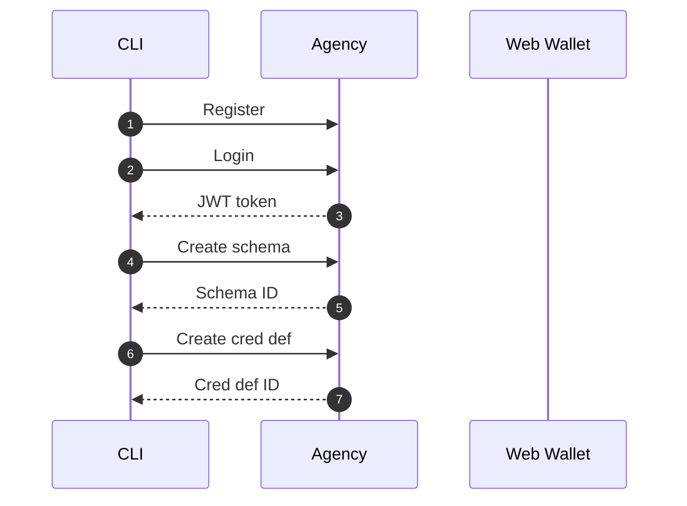
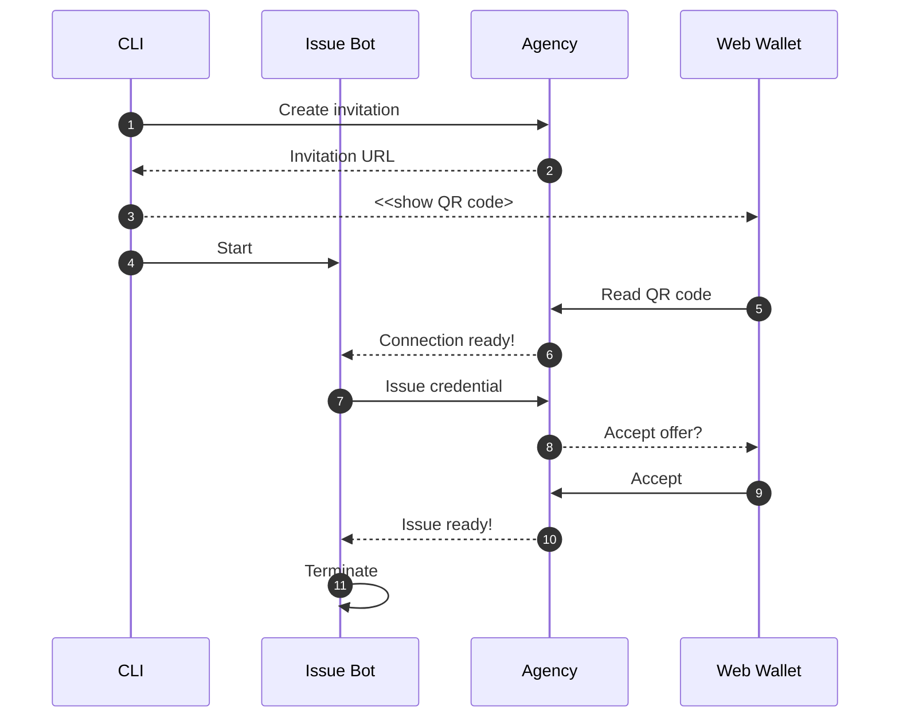
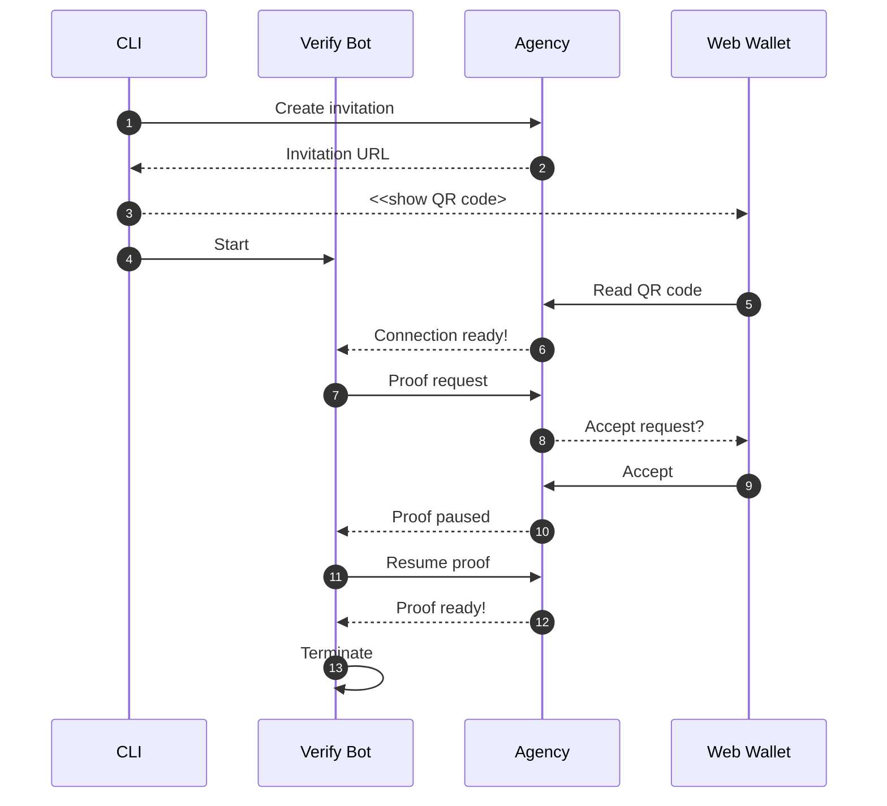

In the new SSI world, we craft digital services according to the self-sovereign identity model.
We will have applications that issue credentials for the data they possess and applications
that can verify these credentials. The central entity is the digital wallet owner
that can hold these credentials and present them when needed.

*"Ok, sounds great!"* you may think.
 *"I want to utilize credentials also in my web application. But where to start?"*

Developing decentralized applications is tricky as it usually requires setting up
multiple applications on your local computer or acquiring access to services set up by others.
Using Findy Agency tackles this hurdle. It is an SSI solution that offers
a complete set of tools for managing your digital wallet and agent via a user interface or an API.


<em>Findy Agency provides tools for playing each role in the trust triangle: CLI and API clients
have the complete tool pack, and the web wallet user can currently hold and prove credentials.
</em>


The Agency tooling provides you with [a web wallet](https://github.com/findy-network/findy-wallet-pwa)
and a CLI tool that you can use to test
your service's issuing and verifying features. You can easily setup the whole Findy Agency
software to your local computer [using Docker containers and a simulated ledger](https://github.com/findy-network/findy-wallet-pwa/tree/dev/tools/env#agency-setup-for-local-development).
Or, if you have an agency cloud installation available, you can utilize it for your
service agent development without using any extra proxies or network tools.

*"So, I have the agency up and running. What next?"*

**TL;DR** Take a look at the examples found in [the sample repository](https://github.com/findy-network/identity-hackathon-2023)!

The sample repository provides simple yet comprehensive examples to start issuing and verifying
using the CLI tool or with the agency API. The easiest path is to start with the CLI.

## Run the CLI

["findy-agent-cli"](https://github.com/findy-network/findy-agent-cli)
is a command-line tool that provides all the required
agent manipulation functionality. It provides means to quickly test out
the issuing and verifying *before writing any code*.

[The sample script](https://github.com/findy-network/identity-hackathon-2023/tree/master/cli#cli-example)
is a good starting point. It shows how to allocate an agent in the cloud
and issue and verify credentials using a simple chatbot. You can run it by cloning [the repository](https://github.com/findy-network/identity-hackathon-2023)
and following the instructions in the README.

### CLI Script Initialization Phase

The sample script initialization phase allocates a new agent from the agency (**1**)
and authenticates the CLI user (**2-3**). The authentication returns a JWT token
exposed to the script environment so that further CLI calls can utilize it
automatically.

For the agent to issue credentials, an applicable schema needs to exist.
The schema describes the contents of a credential, i.e., which attributes the credential contains.
The sample script creates a schema "foobar" with a single attribute "foo" (**4-5**).

There needs to be more than the mere schema for the issuing process; the agent needs also to create
and publish its credential definition (**6-7**) attached to the created schema so that it can issue
credentials and verifiers can verify the proof presentations against the published credential definition.

We assume that the holder operates a web wallet and [has taken it into use](https://github.com/findy-network/findy-wallet-pwa#registerlogin).
Note that you can play the holder role also with the CLI tool.

### CLI Script Issuing Credential

The next task is to create a pairwise connection between the agent operated by the CLI user
and the web wallet user. The pairwise connection is an encrypted pipe between the two
agents that they can use to exchange data securely. The CLI script creates an invitation (**1-2**)
and prints it out (**3**) as a QR code that the web wallet user can read (**5**).

Once the new connection ID is known, the CLI script starts a chatbot (**4**) for the new connection.
The bot logic follows the rules for changing the bot states in the YAML file. Therefore,
the bot handles the rest of the issuing process (**6-7**).

Once the issuer bot notices that credential issuing succeeded, it stops the bot (**10-11**), and
the sample script moves on to verifying the same credential.

### CLI Script Verifying Credential

Steps **1-6** proceed similarly to the issuing: first, the agents form a new pairwise connection.
However, the process continues with a proof request sent by the verifier bot (**7**). The proof request
contains the attributes the bot wishes the holder to present. The web wallet user sees
the requested data once they receive the message (**8**), and they can either accept or reject the request.

After the proof is accepted (**9**), the agency verifies it cryptographically.
If the verification succeeds, the agency notifies the verifier bot with the proof values (**10**).
It can reject the proof if the values are not acceptable by the business logic.
The sample bot accepts all attribute values, so the verifying process is continued
without extra validation (**11**).
The bot exits when the proof is completed (**12-13**).

### CLI as a Test Tool

Note that you can also utilize the CLI for testing.
It is an excellent tool to simulate the functionality on the other end.

For instance, let’s say you are developing an issuer service.
You can use the CLI tool to act as the holder client and to receive the credential.
Or you can use the web wallet to hold the credential
and create another client with the CLI tool to verify the issued data.

## Feedback

The CLI sample script presented above demonstrates all the core features of verified data flow.
It should make you well-equipped to play around with the CLI tool yourself!

Your tool pack will extend even more with our next blog posts.
They will describe how to use the agency API programmatically
and dive deep into crafting verified data supporting chatbot state machines.

Let us know if you have any feedback regarding
the Findy Agency functionality or documentation.
You can reach us, for example [creating an issue](https://github.com/findy-network/findy-agent/issues)
or [starting a discussion](https://github.com/findy-network/findy-agent/discussions) in GitHub.

You can also reach us via SoMe channels:

Laura

<a href="https://github.com/lauravuo/" target="_blank" rel="noopener noreferer"><i class="fab fa-github ml-2 "></i></a>
<a href="https://www.linkedin.com/in/lauravuorenoja/" target="_blank" rel="noopener noreferer"><i class="fab fa-linkedin ml-2 "></i></a>
<a href="https://mastodontti.fi/@lauravuo" target="_blank" rel="noopener noreferer"><i class="fab fa-mastodon ml-2 "></i></a>
<a href="https://twitter.com/vuorenoja" target="_blank" rel="noopener noreferer"><i class="fab fa-twitter ml-2 "></i></a>

Harri

<a href="https://github.com/lainio/" target="_blank" rel="noopener noreferer"><i class="fab fa-github ml-2 "></i></a>
<a href="https://www.linkedin.com/in/harrilainio/" target="_blank" rel="noopener noreferer"><i class="fab fa-linkedin ml-2 "></i></a>
<a href="https://twitter.com/harrilainio" target="_blank" rel="noopener noreferer"><i class="fab fa-twitter ml-2 "></i></a>

  

*Good luck on your journey into the SSI world!*
