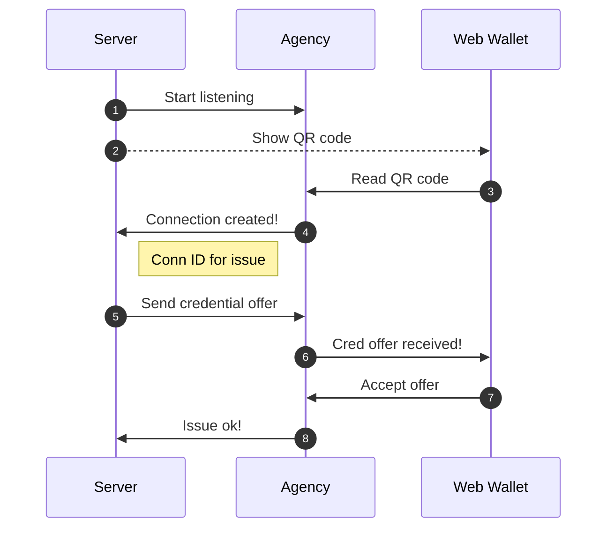

[My previous blog post](/blog/2023/01/30/getting-started-with-ssi-service-agent-development/)
explained how to get started with SSI service agents using our CLI tool.
But what about the next step, the integration into your application?

As I have previously described [in my earlier blog post](https://findy-network.github.io/blog/2022/08/29/the-findy-agency-api/),
Findy Agency API is the interface to
Findy Agency for clients that wish to use the agency services programmatically. You can compile the
gRPC API for [multiple languages](https://grpc.io/docs/languages/).
However, the most straightforward is to start with the ones for which we provide some additional tooling:
**Go**, **Typescript** (JavaScript), or **Kotlin**.

## The Server Samples

[The sample repository](https://github.com/findy-network/identity-hackathon-2023) has an example
server for each of the three languages. You can run the samples
by cloning the repository and following
the instructions in the README.

The sample servers demonstrate a similar issuing and verifying example as the CLI script in the previous post.
The server has two endpoints, `/issue` and `/verify`.
Both endpoints display QR codes for connection invitations.
The server starts a listener who gets notified when a new connection is established
(the holder has read the invitation).
The notification triggers either the credential issuance or verification,
depending on the endpoint that displayed the invitation.


<em>Reading the QR code from the issue page triggers a credential offer.
The Web Wallet is displayed on the right side with its chat UI.</em>



<em>The connection created from the verify page triggers a proof request.
The sample creates dedicated connections for both issue and verify operations,
but it would be possible to use the same connection as well. </em>


## The Server Code

I have gathered snippets to which you should pay close attention when checking the sample code.
The snippets chosen here are from [the Go sample](https://github.com/findy-network/identity-hackathon-2023/tree/master/go),
but each server contains similar functionality.

### Client Registration and Authentication

The agency API clients use [headless FIDO2 authentication](/blog/2021/11/09/anchoring-chains-of-trust/#headless-fido2webauthn-authenticator).
Before the client
can make any API requests, it must authenticate and acquire a JWT token using the FIDO2 protocol.
This Go example uses the authenticator functionality from
the *[github.com/findy-network/findy-agent-auth](https://github.com/findy-network/findy-agent-auth)* package.
Other implementations (Typescript, Kotlin)
currently utilize the [findy-agent-cli](https://github.com/findy-network/findy-agent-cli)
binary for headless authentication.

[The sample code](https://github.com/findy-network/identity-hackathon-2023/blob/b6462464dca79415271a7c179e0c5f8b1373b280/go/agent/agent.go#L186)
tries to authenticate first, and only if the authentication fails
will it try the client registration. The registration binds the client key to the client account,
and after a successful registration, the client can log in and receive the JWT token needed
for the API calls.

```go
import (
  ...

  "github.com/findy-network/findy-agent-auth/acator/authn"
)

...

// use command from the headless authenticator package
var authnCmd = authn.Cmd{
  SubCmd:   "",
  UserName: os.Getenv("FCLI_USER"),// client username
  Url:      os.Getenv("FCLI_URL"), // FIDO2 server URL
  AAGUID:   "12c85a48-4baf-47bd-b51f-f192871a1511",
  Key:      os.Getenv("FCLI_KEY"), // authenticator key
  Counter:  0,
  Token:    "",
  Origin:   os.Getenv("FCLI_ORIGIN"),
}

...

func (a *Agent) register() (err error) {
  defer err2.Handle(&err)

  myCmd := authnCmd
  myCmd.SubCmd = "register"

  try.To(myCmd.Validate())
  try.To1(myCmd.Exec(os.Stdout))
  return
}

func (a *Agent) login() (err error) {
  defer err2.Handle(&err)

  myCmd := authnCmd
  myCmd.SubCmd = "login"

  try.To(myCmd.Validate())
  r := try.To1(myCmd.Exec(os.Stdout))

  // store token for successful authentication
  a.JWT = r.Token
  return
}

```

With a valid JWT, the client can create the gRPC API connection and the real fun can begin!

```go
import (
  ...

  "github.com/findy-network/findy-common-go/agency/client"
  agency "github.com/findy-network/findy-common-go/grpc/agency/v1"
  "google.golang.org/grpc"
)

  ...
  // set up API connection
  conf := client.BuildClientConnBase(
    os.Getenv("FCLI_TLS_PATH"),
    agent.AgencyHost,
    agent.AgencyPort,
    []grpc.DialOption{},
  )

  conn := client.TryAuthOpen(agent.JWT, conf)

  agent.Client = &AgencyClient{
    Conn:           conn,
    AgentClient:    agency.NewAgentServiceClient(conn),
    ProtocolClient: agency.NewProtocolServiceClient(conn),
  }

```

### Schema and Credential Definition Creation

When the server starts for the first time, it creates a schema and a credential definition.
The issuer always needs a credential definition to issue credentials.
For the verifier, it is enough to know the credential definition id.

```go

  // use the agent API to create schema and credential definition
  schemaRes := try.To1(a.Client.AgentClient.CreateSchema(
    context.TODO(),
    &agency.SchemaCreate{
      Name:       schema.Name,
      Version:    "1.0",
      Attributes: schema.Attributes,
    },
  ))
  ... 
  // tag the credential definition with our client username
  res := try.To1(a.Client.AgentClient.CreateCredDef(
    context.TODO(),
    &agency.CredDefCreate{
      SchemaID: schemaRes.ID,
      Tag:      authnCmd.UserName,
    },
  ))
  credDefID = res.GetID()
```

The app stores the created credential definition ID in a text file. The app will skip
the credential definition creation step if this text file exists on the server bootup.

The credential definition ID is essential.
You should share it with whoever needs to verify the credentials issued by your issuer.

### Creating the Invitation

After the start routines, the server endpoints are ready to display the pairwise connection invitations.
The holder agent can establish a secure pairwise connection with the information in the invitation.

The client uses CreateInvitation-API to generate the invitation:

```go
  res := try.To1(ourAgent.Client.AgentClient.CreateInvitation(
    context.TODO(),
    &agency.InvitationBase{Label: ourAgent.UserName},
  ))
```

The endpoint returns HTML that renders the invitation as QR code.

When using a mobile device, the invitation can be read with the web wallet camera or desktop browser,
copy-pasting the invitation URL to the Add connection -dialog.

### Listening to Notifications

Another core concept in the client implementation is listening to the agent notifications.
The client opens a gRPC stream to the server and receives notifications of the agent
events through the stream.

```go

  // pick notifications from stream channel
  ch := try.To1(agent.Client.Conn.ListenStatus(
    context.TODO(),
    &agency.ClientID{ID: agent.ClientID},
  ))

  // start go routine for the channel listener
  go func() {
    for {
      chRes, ok := <-ch
      if !ok {
        panic("Listening failed")
      }
      notification := chRes.GetNotification()
      log.Printf("Received agent notification %v\n", notification)

      ...

      switch notification.GetTypeID() {
      ...
      case agency.Notification_STATUS_UPDATE:
        switch notification.GetProtocolType() {
        case agency.Protocol_DIDEXCHANGE:
          agent.Listener.HandleNewConnection(status.GetDIDExchange().ID)
          ...
        }
        ...
      }
    }
 }()

```

For instance, when the server creates a pairwise connection so that the holder can connect to
the issuer, the notification of the new connection is sent through the stream.



In the sequence above, steps **4** and **8** are notifications sent through the listener stream.

The client can then
react to the event accordingly. For example,
when a new connection is established from the issue endpoint, the client sends a credential offer:

```go
func (a *AgentListener) HandleNewConnection(id string) {
  ...
  // pairwise based on the connection id
  pw := client.NewPairwise(ourAgent.Client.Conn, id)

  ...
  // credential values
  attributes := make([]*agency.Protocol_IssuingAttributes_Attribute, 1)
  attributes[0] = &agency.Protocol_IssuingAttributes_Attribute{
   Name:  "foo",
   Value: "bar",
  }

  // send the offer
  res := try.To1(pw.IssueWithAttrs(
   context.TODO(),
   ourAgent.CredDefID,
   &agency.Protocol_IssuingAttributes{
    Attributes: attributes,
   }),
  )
  ...
}
```

A similar flow happens when the proof is verified. The exception with the proof is that there is
an additional step where the client
can reject the proof
if the proof values are not valid according to the business logic
(even though the proof would be cryptographically valid).

## Start with Your Use Case

Now you should have the technical setup ready to start implementing your use case.
But as with always in software development, we need more than technical capabilities.
Before starting the implementation, try to figure out the roles and duties of your process participants:

**Define the credential(s) content.**
Think about which data attributes you need. The sample issues the type “foobar” credentials
with a single attribute “foo.” Foobar data is probably not the type you wish to issue and utilize.

**Define the data flow participants.**
Draft your data flow and resolve which parties are the issuer, verifier, and holder or
are some parties even in multiple roles. In the sample, a single service agent handles both issuing
and verifying. That is not a probable scenario in a real-world use case, as the whole point of SSI
and verified data use is to verify credentials that other parties have issued.

**Define how you operate each verified data flow participant.**
The sample had a CLI tool or API client as the issuer and verifier and a web wallet user
as the holder. Depending on the use case, you might have a similar setup or, for example,
another service agent as the holder in a service-to-service scenario. Or you would like
to integrate the holder capabilities into your end-user application instead of using
the agency web wallet.

Of course, in cases where we have multiple real-world parties
involved, the detailed design is done together with the other participants.

## Feedback

Let us know if you have any feedback regarding
the Findy Agency functionality or documentation. It would also be cool [to hear about
the PoCs, demos and applications you have built](https://github.com/findy-network/findy-agent/discussions/new?category=show-and-tell)
using the agency.

You can also reach us via SoMe channels:

<div style="display: flex">
<span>

<div>Laura</div>
<div><a href="https://github.com/lauravuo/" target="_blank" rel="noopener noreferer"><i class="fab fa-github ml-2 "></i></a>
<a href="https://www.linkedin.com/in/lauravuorenoja/" target="_blank" rel="noopener noreferer"><i class="fab fa-linkedin ml-2 "></i></a>
<a href="https://fosstodon.org/@lauravuo" target="_blank" rel="noopener noreferer"><i class="fab fa-mastodon ml-2 "></i></a>
<a href="https://twitter.com/vuorenoja" target="_blank" rel="noopener noreferer"><i class="fab fa-twitter ml-2 "></i></a></div>
</span><span style="padding-left: 2em">

<div>Harri</div>
<div><a href="https://github.com/lainio/" target="_blank" rel="noopener noreferer"><i class="fab fa-github ml-2 "></i></a>
<a href="https://www.linkedin.com/in/harrilainio/" target="_blank" rel="noopener noreferer"><i class="fab fa-linkedin ml-2 "></i></a>
<a href="https://twitter.com/harrilainio" target="_blank" rel="noopener noreferer"><i class="fab fa-twitter ml-2 "></i></a></div>
</span></div><br><br>
