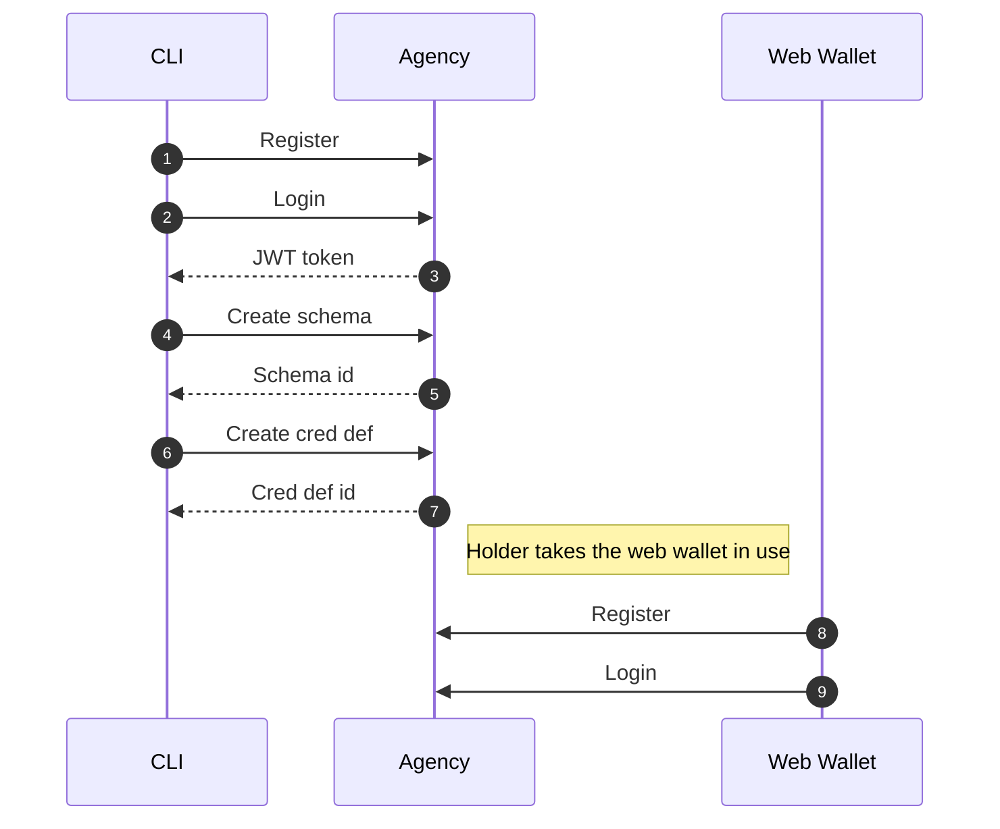
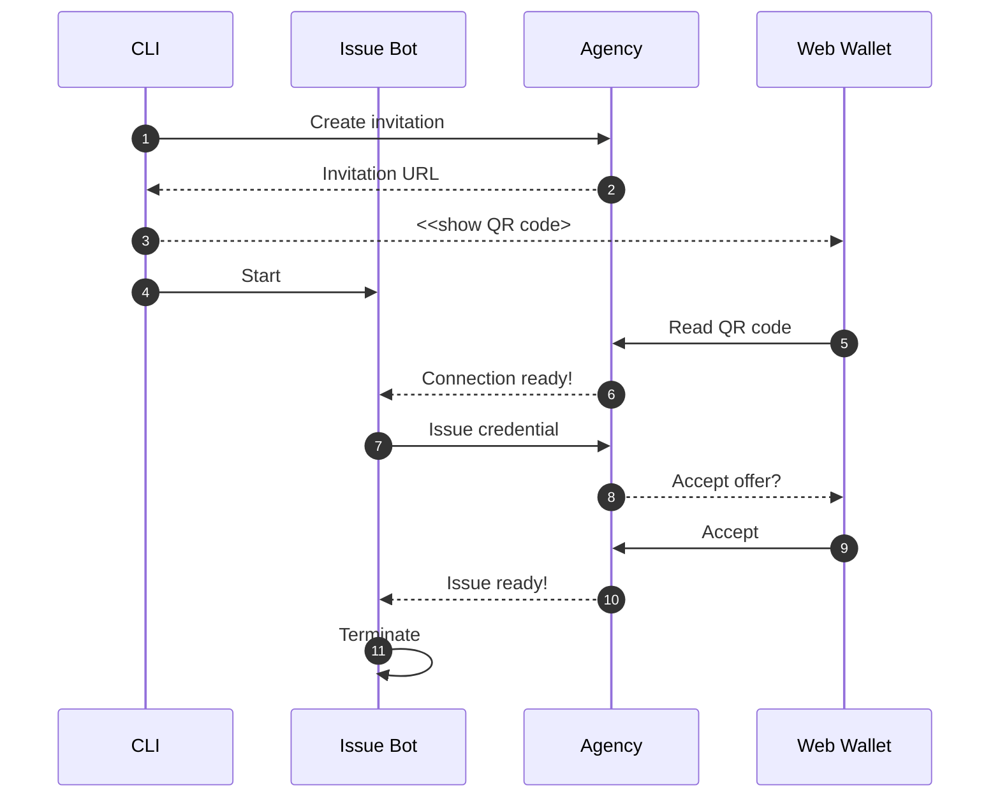
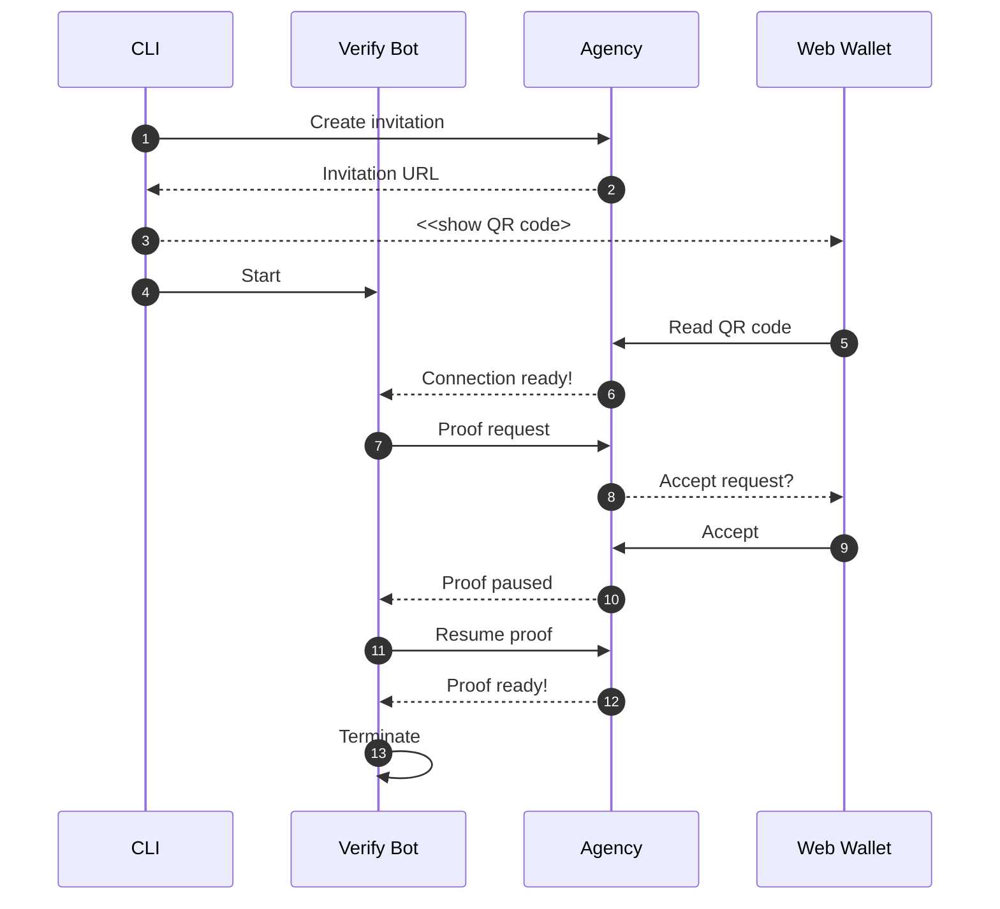

In the new SSI world, we craft digital services according to the self-sovereign identity model.
We will have applications that issue credentials for the data they possess and applications
that can verify these credentials. The central entity is the digital wallet owner
that can hold these credentials and present them when needed.

*"Ok, sounds great!"* you may think.
 *"I want to utilize credentials also in my web application. But where to start?"*

Developing decentralized applications is tricky as it usually requires setting up
multiple applications on your local computer or acquiring access to services set up by others.
Using Findy Agency tackles this hurdle. It is an SSI solution that offers
a complete set of tools for managing your digital wallet and agent via a user interface or an API.


<em>Findy Agency provides tools for playing each role in the trust triangle: CLI and API clients
have the complete tool pack, and the web wallet user can currently hold and prove credentials.
</em>


The Agency tooling provides you with [a web wallet](https://github.com/findy-network/findy-wallet-pwa)
and a CLI tool that you can use to test
your service's issuing and verifying features. You can setup easily the whole Findy Agency
software to your local computer [using Docker containers and a simulated ledger](https://github.com/findy-network/findy-wallet-pwa/tree/dev/tools/env#agency-setup-for-local-development).
Or, if you have an agency cloud installation available, you can utilize it for your
service agent development without using any extra proxies or network tools.

*"So, I have the agency up and running. What next?"*

**TL;DR** Take a look at the examples found in [the sample repository](https://github.com/findy-network/identity-hackathon-2023)!

## Run the CLI

["findy-agent-cli"](https://github.com/findy-network/findy-agent-cli)
is a command-line tool that provides all the required
agent manipulation functionality. It provides means to quickly test out
the issuing and verifying *before writing any code*.

[The sample script](https://github.com/findy-network/identity-hackathon-2023/tree/master/cli#cli-example)
is a good starting point. It shows how to allocate an agent in the cloud
and issue and verify credentials using a simple chatbot. You can run it by cloning [the repository](https://github.com/findy-network/identity-hackathon-2023)
and following the instructions in the README.

### CLI Script Initialization Phase

The sample script initialization phase allocates a new agent from the agency (**1**)
and authenticates the CLI user (**2-3**). The authentication returns a JWT token
exposed to the script environment so that further CLI calls can utilize it
automatically.

For the agent to issue credentials, an applicable schema needs to exist.
The schema describes the contents of a credential, i.e., which attributes the credential contains.
The sample script creates a schema "foobar" with a single attribute "foo" (**4-5**).

There needs to be more than the mere schema for the issuing process; the agent needs also to create
and publish its credential definition (**6-7**) attached to the created schema so that it can issue
credentials and verifiers can verify the proof presentations against the published credential definition.

We assume that the holder operates a web wallet and has taken it into use (**8-9**).

### CLI Script Issuing Credential

The next task is to create a pairwise connection between the agent operated by the CLI user
and the web wallet user. The pairwise connection is an encrypted pipe between the two
agents that they can use to exchange data securely. The CLI script creates an invitation (**1-2**)
and prints it out (**3**) as a QR code that the web wallet user can read (**5**).

Once the new connection id is known, the CLI script starts a chatbot (**4**) for the new connection.
The bot logic follows the rules for changing the bot states in the YAML configuration file. Therefore,
the bot handles the rest of the issuing process (**6-7**).

Once the issuer bot notices that credential issuing succeeded, it stops the bot (**10-11**), and
the sample script moves on to verifying the same credential.

### CLI Script Verifying Credential

Steps **1-6** proceed similarly to the issuing: first, the agents form a new pairwise connection.
However, the process continues with a proof request sent by the verifier bot (**7**). The proof request
contains the attributes the bot wishes the holder to reveal. The web wallet user sees
the requested data once they receive the message (**8**), and they can either accept or reject the request.

Once the proof is accepted (**9**), the agency verifies it cryptographically.
If the verification succeeds, the agency notifies the verifier bot with the proof values (**10**).
It can reject the proof if the values are not acceptable by the business logic.
The sample bot accepts all attribute values, so the verifying process is continued
without extra validation (**11**).
The bot exits when the proof is completed (**12-13**).

And that’s all core features of verified data flow executed utilizing the CLI tool!

### CLI as a Test Tool

Note that you can also utilize the CLI for testing.
It is an excellent tool to simulate the functionality on the other end.

For instance, let’s say you are developing an issuer service.
You can use the CLI tool to manage the holder client and to receive the credential.
Or you can use the web wallet to hold the credential
and create another client with the CLI tool to verify the issued data.

## Run the Server Samples

Ok, so you have now taken over the CLI tool, but how about the integration into your application?

As I have previously described [in my earlier blog post](https://findy-network.github.io/blog/2022/08/29/the-findy-agency-api/),
Findy Agency API is the interface to
Findy Agency for clients that wish to use the agency services programmatically. You can compile the
gRPC API for [multiple languages](https://grpc.io/docs/languages/).
However, the most straightforward is to start with the ones for which we provide some additional tooling:
Go, Typescript (JavaScript), and Kotlin.

The sample repository has an example server for each of these languages. You can run the samples
by cloning [the repository](https://github.com/findy-network/identity-hackathon-2023) and following
the instructions in the README.

The sample servers demonstrate a similar issuing and verifying example as the CLI script above.
The server has two endpoints, `/issue` and `/verify`.
Both endpoints display QR codes for connection invitations.
The server starts a listener who gets notified when a new connection is established
(the holder has read the invitation).
The notification triggers either the credential issuance or verification,
depending on the endpoint that displayed the invitation.


<em>Reading the QR code from the issue page triggers a credential offer.
The Web Wallet is displayed on the right side with its chat UI.</em>



<em>The connection created from the verify page triggers a proof request.
The sample creates dedicated connections for both issue and verify operations,
but it would be possible to use the same connection as well. </em>


Check the sample code for selected language and pay attention to

* client registration and authentication,
* schema and credential definition creation,
* creating the pairwise connection invitation,
* and starting the client listener and reacting to the notifications coming from the agency.

## Start with Your Use Case

Now you should have the technical setup ready to start implementing your use case.
But as with always in software development, we need more than technical capabilities.
Before starting the implementation, try to figure out the roles and duties of your process participants:

**Define the credential(s) content.**
Think about which data attributes you need. The sample issues the type “foobar” credentials
with a single attribute “foo.” Foobar data is probably not the type you wish to issue and utilize.

**Define the data flow participants.**
Draft your data flow and resolve which parties are the issuer, verifier, and holder or
are some parties even in multiple roles. In the sample, a single service agent handles both issuing
and verifying. That is not a probable scenario in a real-world use case, as the whole point of SSI
and verified data use is to verify credentials that other parties have issued.

**Define how you operate each verified data flow participant.**
The sample had a CLI tool or API client as the issuer and verifier and a web wallet user
as the holder. Depending on the use case, you might have a similar setup or, for example,
another service agent as the holder in a service-to-service scenario. Or you would like
to integrate the holder capabilities into your end-user application instead of using
the agency web wallet.

Of course, in cases where we have multiple real-world parties
involved, the detailed design is done together with the other participants.

## Feedback

Let us know if you have any feedback regarding
the Findy Agency functionality or documentation. It would also be cool [to hear about
the PoCs, demos and applications you have built](https://github.com/findy-network/findy-agent/discussions/new?category=show-and-tell)
using the agency. You can reach us, for example creating an issue or starting
a discussion in GitHub
or sending a message to me via these SoMe channels:
[Twitter](https://twitter.com/vuorenoja),
[Mastodon](https://mastodontti.fi/@lauravuo), and [LinkedIn](https://www.linkedin.com/in/lauravuorenoja/).

*Good luck on your journey into the SSI world!*
