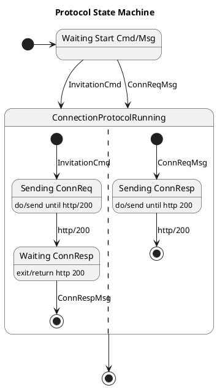

Since jumping on the OSS (Open Source Software) wagon, I have been learning
new things about software development and getting more proof to do something in
specific ways. Two of my favorite 'things' At the *code level* are **readability**
and **modifiability**. The latter is a very old friend of SW architecture's
quality attributes ([Software Architecture in Practice, Len Bass, et
al.](https://www.oreilly.com/library/view/software-architecture-in/9780132942799/)).
Still, it is not well aligned with the current *practices and tools* in the OSS scene
because everything is so text-centric. So, let's make it as readable as we can.

> [*"A picture is worth a thousand words"*](https://en.wikipedia.org/wiki/A_picture_is_worth_a_thousand_words)

Practise has taught that software architecture must be expressed in various
notations; most are visual. For example, most of us can reason that a
well-grafted state-machine diagram must be faster than a code written our
favorite programming language. For instance, the next state-machine diagram’s
protocol implementation is constructed of thousands of lines of code structured
in multiple files that depend on external modules and libraries. We need
abstraction layers to manage all that complexity.



Expressing things with the control-flow structures of imperative (or functional)
programming languages is more challenging – especially when the correctness of
the design should be verified. It seems that it’s easy to forget software
quality attributes during fast-phasing programming if we use tools that only
manage sequential text, i.e., code. At the code level, we should use functions
that give us an abstraction hierarchy and help us to maintain readability.

Moreover, since my studies of SW architecture’s quality attributes, I have
understood that modifiability is more than modularity, re-usability, or using
correct architectural styles like pipe and filter. Now we understand the importance of
[TTD](https://en.wikipedia.org/wiki/Test-driven_development), [continuous
deployment](https://en.wikipedia.org/wiki/Continuous_deployment),
[DevOps](https://en.wikipedia.org/wiki/DevOps), etc. The practices above
don't work only on *one* of the engineering domains. The best results are
achieved **cross-domain engineering practices**. 

In this post, I'll go through some fundamental Go tools and tricks you could use
to achieve *decent execution speed of your (Go) software and maintain or
increase its readability.*

# Perfect Code?

I suppose all of us programmers have heard of the infamous *premature optimization*:

> *The real problem is that programmers have spent far too much time worrying
> about efficiency in the wrong places and at the wrong times; premature
> optimization is the root of all evil (or at least most of it) in programming.*


That’s the full quote from the must-read *The Art of Computer Programming by
Donald Knuth*. Like so many pearls of wisdom, they are a child of their own time.
They are usually dangerously separated from their context to underline the
message the next author wants to emphasize their statement. I believe most of us
have read the quotation in its shortened format:

> *Premature optimization is the root of all evil in programming.*

Really? I don't think so.

I claim that if **keeping performance is your second nature, it’ll not ruin the
other quality attributes of your code, but the opposite**. All you need to do is
to follow some basic rules with your muscle memory.

## Performance Rules

In this post, I concentrate only on these three:

1. **Heap allocations are computationally expensive**. (We out-scope garbage
   collection because it's such a significant topic that even one book is insufficient.)
1. **A function call is computationally expensive** if the compiler cannot [inline
   expanse](https://en.wikipedia.org/wiki/Inline_expansion) it.
1. **Minimize the problem space at every level of abstraction** and the need
   for variables, i.e. especially in inner loops. Consider what parts of
   inputs are really varying and what parts are constant. For example, think
   twice if you need regexp inside of your program.

## Code Readability

We want to maximize our **code’s readability**. One of the Go code’s problems is
that it overuses the if-statement, which prevents you from noticing the
algorithm's critical decision points.

For example, Go’s standard library includes quite many of the following code
blocks:

```go
func doSomething(p any, b []byte) {
    if p == nil {
        panic("input argument p cannot be nil")
    }
    if len(b) == 0 {
        panic("input argument p cannot be nil")
    }
    ...
    err := w.Close()
    if err != nil {
        log.Fatal(err)
    }
}
```

It’s easy to see that together with Go’s if-based error checking, these two hide
the happy path and make it difficult to follow the algorithm and skim the code.
The same thing can be found from Go’s unit tests if no 3rd party helper package
is used:

```go
     for _, tt := range tests {
          t.Run(tt.name, func(t *testing.T) {
               r := <-Open(tt.args.config, tt.args.credentials)
               if got := r.Err(); !reflect.DeepEqual(got, tt.want) {
                    t.Errorf("Open() = %v, want %v", got, tt.want)
               }
               w := r.Handle()
               if got := (<-Export(w, tt.args.exportCfg)).Err(); !reflect.DeepEqual(got, tt.want) {
                    t.Errorf("Export() = %v, want %v", got, tt.want)
               }
               if got := (<-Close(w)).Err(); !reflect.DeepEqual(got, tt.want) {
                    t.Errorf("Close() = %v, want %v", got, tt.want)
               }
          })
     }
```

The above code block is from a different test than the block below, but I think
you get the idea. I’m speaking fast skimming of code where simplicity and form
help a lot. Very much similar to syntax highlighting.

```go
func TestNewTimeFieldRFC3339(t *testing.T) {
     defer assert.PushTester(t)()

     var testMsg Basicmessage
     dto.FromJSON([]byte(timeJSONRFC3339), &testMsg)
     timeValue := testMsg.SentTime

     assert.INotNil(timeValue)
     assert.Equal(timeValue.Year(), 2022)
     assert.Equal(timeValue.Month(), time.September)
     assert.Equal(timeValue.Day(), 30)
}
```

That's clear and easy to skim. It's also straightforward to extend to use table
testing. I left it for the reader to figure out how that code renders without
an assert package.

## Function Inline Expansion

Let's write our version of the famous `assert` function to show how function
inlining can help readability outside of the tests without sacrificing
performance.

```go
func assert(term bool, msg string) {
    if !term {
        panic(msg)
    }
    ...

func doSomething(p any, b []byte) {
    assert(p != nil, "interface value cannot be nil")
    assert(len(b) != 0, "byte slice cannot be empty (or nil)")
    ...
    // coninuet with something imporant
```

By writing the benchmark function for `assert` with Go's testing capabilities,
you can measure the 'weight' of the function itself. You get the comparison
point by writing the reference benchmark where you have manually inline-expansed
the function, i.e. by hand. However, if you aren't interested in the actual
performance figures but just the information about successful inline expansion
done by the compiler, you can ask:

```
go test -c -gcflags=-m=2 <PKG_NAME> 2>&1 | grep 'inlin'
```

The `-gcflags=-m=2` gives lots of information, but we can filter only those
lines that contain messages inlining. Depending on the size of the packages
there can be an overwhelming lot of information where most of them aren't
related to the task in your hand. You can always filter more.

The `-gcflags` will be your programming buddy in the future. To get more
information about the flags, run:

```
go build -gcflags -help
```

## Memory Allocations

Similarly, as function calls, the memory allocations from the heap are
expensive. It’s good practice to prevent unnecessary allocations even when the
programming platform has a garbage collector. With the Go, it’s essential to
understand the basics of memory management principles Go uses because of memory
locality, i.e., it has pointers and value types. Many other garbage-collected
languages have object references, and the [memory
locality](https://www.youtube.com/watch?v=bmZNaUcwBt4&t=1626s) is hidden from
the programmer, leading to poor performance, e.g., cache misses.

But nothing comes for free – you need to know what you’re doing. Go’s compiler
analyzes your code and, without your help, can decide if a variable is *escaping*
from its scope and needs to be moved from a stack to the heap.

Go’s tools give you extra information about [escape
analyzes](https://appliedgo.com/blog/how-to-do-escape-analysis). Use the
`-gcflags=-m=2` again, but `grep` *escape* lines from the output. That will tell
you exactly what’s going on with the pointers for every function in the current
compilation.

Usually, when benchmarking Go code, it’s good to understand what’s going on with
heap allocations. Just add the following argument e.g., your test benchmark
compilation, and you get the statistics of allocations in the benchmark run.

```
go test -benchmem -bench=. <PKG_NAME>
```

The `-benchmem` flag inserts two columns to benchmarking results:

```
go test -benchmem -bench=. github.com/lainio/err2/internal/str
goos: linux
goarch: arm64
pkg: github.com/lainio/err2/internal/str
BenchmarkDecamelRegexp-5          400387              2994 ns/op             666 B/op             19 allocs/op
BenchmarkDecamel-5               3707656               329.3 ns/op            96 B/op              1 allocs/op
PASS
ok      github.com/lainio/err2/internal/str     2.784s
```

Please note that five (5) columns are now instead of standard three. The extra
two (rightmost) are the about memory allocations. `B/op` is the average amount of
bytes per memory allocation in the rightmost column `allocs/op.`

Fewer allocations are better and smaller the size of the allocations. Please
note that the performance difference between the above benchmark results isn’t
because of the allocations only. Most of the differences will be explained in
the following chapters. But still, allocations are something you should be aware
of, especially about the variable escaping if it leads to heap allocations.

## How Dynamic Are The Inputs?

How much do the variables in your program change, or maybe they are constant?
Naturally, **the smaller the actual input set of the function, the better chance
we have to optimize** its performance because the more deterministic the solution
will be. Also, smaller machine code performs better in modern memory-bound CPUs.
The same cache rules apply to instructions as variables. CPU doesn’t need to
access RAM if all the required code is already in the CPU.

The above benchmark results are from two functions that do the same thing. This
is the regexp version of it (first row in the benchmark results):

```go
var (
	uncamel = regexp.MustCompile(`([A-Z]+)`)
	clean   = regexp.MustCompile(`[^\w]`)
)

// DecamelRegexp return the given string as space delimeted. Note! it's slow. Use
// Decamel instead.
func DecamelRegexp(str string) string {
	str = clean.ReplaceAllString(str, " ")
	str = uncamel.ReplaceAllString(str, ` $1`)
	str = strings.Trim(str, " ")
	str = strings.ToLower(str)
	return str
}
```

Go’s regexp implementation is known to be relatively slow, but if you think that
regexp needs its compiler and processor, it’s not so surprising.

The hand-optimized version of the Decamel function is almost ten times faster.
It sounds pretty much like it’s natural because we don’t need all the
versatility of the entire regexp. We need to transform the inputted CamelCase
string to a standard lowercase string. However, in this case, the input strings
aren’t without some exceptions because they come from the Go compiler itself.
And still, the input set is small enough that we quickly see the difference. And
now, we can shrink the problem space to our specific needs.

The faster version of Decamel that’s still quite readable:

```go
func Decamel(s string) string {
     var (
          b           strings.Builder
          splittable  bool
          isUpper     bool
          prevSkipped bool
     )
     b.Grow(2 * len(s))

     for i, v := range s {
          skip := v == '(' || v == ')' || v == '*'
          if skip {
               if !prevSkipped && i != 0 { // first time write space
                    b.WriteRune(' ')
               }
               prevSkipped = skip
               continue
          }
          toSpace := v == '.' || v == '_'
          if toSpace {
               if prevSkipped {
                    continue
               } else if v == '.' {
                    b.WriteRune(':')
               }
               v = ' '
               prevSkipped = true
          } else {
               isUpper = unicode.IsUpper(v)
               if isUpper {
                    v = unicode.ToLower(v)
                    if !prevSkipped && splittable {
                         b.WriteRune(' ')
                         prevSkipped = true
                    }
               } else {
                    prevSkipped = false
               }
          }
          b.WriteRune(v)
          splittable = !isUpper || unicode.IsNumber(v)
     }
     return b.String()
}
```

Let’s take another example where results are even more drastically faster, but
the reason is precisely the same. The input set is much smaller than what the
first implementation function is meant to be used.

The results:

```
goos: linux
goarch: arm64
pkg: github.com/lainio/err2/assert
BenchmarkGoid_MyByteToInt-5     529940133                2.273 ns/op           0 B/op          0 allocs/op
BenchmarkGoid_Old-5              3919933               307.0 ns/op            64 B/op          3 allocs/op
PASS
ok      github.com/lainio/err2/assert   4.136s
```

The first implementation:

```go
func oldGoid(buf []byte) (id int) {
     _, err := fmt.Fscanf(bytes.NewReader(buf), "goroutine %d", &id)
     if err != nil {
          panic("cannot get goroutine id: " + err.Error())
     }
     return id
}
```
The above code is quite self explanatory, and that's very good.

The second and ~~faster~~*fastest* implementation:

```go
func asciiWordToInt(b []byte) int {
     n := 0
     for _, ch := range b {
          if ch == ' ' {
               break
          }
          ch -= '0'
          if ch > 9 {
               panic("cannot get goroutine id")
          }
          n = n*10 + int(ch)
     }
     return n
}
```

These two functions do precisely the same thing, or should I say almost because
the latter’s API is more generic. The converted integer must be the first byte
in the slice.

It is much over 100x faster! Why? Because the only thing we need is to process
the ASCII string that comes in byte slice type.

> You might ask whether this ruined the *readability*, which is fair. But no,
> because the function `asciiWordToInt` is called from `GoroutineID`, which is
> just enough -- trust abstraction layering. (See the rule #1.)

Next time you are writing something, think twice -- I do ;-)

# P.S.

There is so much more about performance tuning in Go. This piece was just a
scratch of the surface. If you are interested in the topic, please get in touch
with our project team, and we will tell you more. We would be delighted if you
join our effort to develop the performing identity agency.
