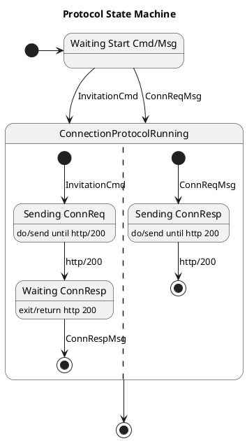

Since jumping the OSS (Open Source Software) wagon I have been learning
new things about software development and get more proofs to do things in
certain ways. At *code level* two of my favorite 'things' are **readability**
and **modifiability**. The latter is a very old friend from SW architecture's
quality attributes ([Software Architecture in Practice, Len Bass et
al](https://www.oreilly.com/library/view/software-architecture-in/9780132942799/)),
but it is not well aligned with the current *practises and tools* in OSS scene
because everything is so text-centric.

> [*"A picture is worth a thousand words"*](https://en.wikipedia.org/wiki/A_picture_is_worth_a_thousand_words)

Practise has taught that software architecture is something that must be
expressed wide variety of notations which most are visual their nature. For
example, most of us can reason well-grafted state-machine diagram must faster
than a code written our favorite programming language. For instance, the next
state-machine diagram's protocol implementation is constructed thousands of
lines of code structured multiple files which have dependencies to external
modules and libraries. We need abstraction layers to manage all that complexity.



Expressing things with the control-flow structures of imperative (or functional)
programming languages is harder -- especially when the correctness of the design
should be verified. It seems that it's easy to forget software quality
attributes during the fast-phasing programming if we are using tools only manage
sequential text, i.e. code. At code level we should use functions that give us
abstraction hierarchy and help us to maintain readability.

Moreover, since my studies of SW architecture's quality attributes I have
understood that modifiability is a lot of more than modularity, re-usability,
or use of correct architecture style like pipe&filter.
Now we understand the importance of
[TTD](https://en.wikipedia.org/wiki/Test-driven_development), [continuous
deployment](https://en.wikipedia.org/wiki/Continuous_deployment),
[DevOps](https://en.wikipedia.org/wiki/DevOps), etc. Aforementioned practises
don't work only on *one* of the engineering domains. The best results are
achieved **cross-domain engineering practises**. 

In this post I'll go thru some very basics of the Go's tooling and tricks that
you could use to achieve *decent execution speed of your (Go) software and
maintain or increase its readability.*

# Perfect Code?

I suppose all of us programmers have heard of infamous *premature optimization*:

> *The real problem is that programmers have spent far too much time worrying
> about efficiency in the wrong places and at the wrong times; premature
> optimization is the root of all evil (or at least most of it) in programming.*

That's the full quote from must-read *The Art of Computer Programming, Donald
Knuth*. Like so many wisdoms they are child of their own time, and quite usually
dangerously separated from their context to underline the message the next
author want to place great emphasis to their message. I believe most of us have
read the quotation in its shortened format:

> *Premature optimization is the root of all evil in programming.*

Really? I don't think so.

I complain that if **keeping performance is your second nature, it'll not ruin
the other quality attributes of your code, but opposite**. All you need to
do is to follow are some basic rules with your muscle memory.

In this post I concentrate only these two:

1. Heap allocations are computationally expensive. (We out-scope garbage
   collection because it's so large topic that even one book is not enough)
1. A function call is computationally expensive if compiler cannot [inline
   expanse](https://en.wikipedia.org/wiki/Inline_expansion) it.
1. Minimize need of variables, i.e. especially in inner loops think what parts
   of inputs are really variable and what parts are constant. For example, think
   twice do you need regexp inside of your program.

## Performance Rules And Readability

We want to maximise our **code's readability**. One of the Go code's problems is
that it over uses if-statement, which prevents you notice the important 
decision points of the algorithm.

For example, Go's standard library includes quite many of the following code
blocks:

```go
func doSomething(p any, b []byte) {
    if p == nil {
        panic("input argument p cannot be nil")
    }
    if len(b) == 0 {
        panic("input argument p cannot be nil")
    }
    ...
    err := w.Close()
    if err != nil {
        log.Fatal(err)
    }
}
```

It's easy to see that together with Go's if-based error checking these two hides
the actual happy path and makes difficult to follow the algorithm and skim the
code. Same thing can be found from Go's unit tests if no 3rd party helper
package is used:

```go
func TestNewTimeFieldRFC3339(t *testing.T) {
     defer assert.PushTester(t)()

     var testMsg Basicmessage
     dto.FromJSON([]byte(timeJSONRFC3339), &testMsg)
     timeValue := testMsg.SentTime

     assert.INotNil(timeValue)
     assert.Equal(timeValue.Year(), 2022)
     assert.Equal(timeValue.Month(), time.September)
     assert.Equal(timeValue.Day(), 30)
}
```

That's clear and easy to skim. It's also very easy to extend to use table
testing. I left it for the reader to figure out how that code renders without
assert package.

### Function Inline Expansion

Let's write our own version of the famous `assert` function to show how function
inlining can help the readability outside of the tests without sacrificing the
performance.

```go
func assert(term bool, msg string) {
    if !term {
        panic(msg)
    }
    ...

func doSomething(p any, b []byte) {
    assert(p != nil, "interface value cannot be nil")
    assert(len(b) != 0, "byte slice cannot be empty (or nil)")
    ...
    // coninuet with something imporant
```

By writing the benchmark function for `assert` with Go's testing capabilities
you can measure the 'weight' of the function itself. And by writing the
reference benchmark where you have inline expansed the function manually, i.e.
by hand, you get the comparison point. However, if you aren't interested the
actual performance figures but just the information about successful inline
expansion done by compiler, you can ask:

```
go test -c -gcflags=-m=2 <PKG_NAME> 2>&1 | grep 'inlin'
```

The `-gcflags=-m=2` gives lots of information, but we can filter only those
lines that contains messages inlining. Depending about the size of the packages
there can be overwhelmingly lot of information where most of them aren't
related to task in your hand. You can always filter more.

The `-gcflags` will be your programming buddy in the future. To get more
information about the flags run:

```
go build -gcflags -help
```

## Memory Allocations

Similarly as function calls the memory allocations from heap are expensive.
It's good practise to prevent unnecessary allocations even when the programming
platform has a garbage collector. With the Go it's especially important to
understand the basics about memory management principles Go uses because of
[memory locality](https://www.youtube.com/watch?v=bmZNaUcwBt4&t=1626s), i.e. it
has pointers and value types. Quite many of the other garbage collected
languages have object references and true memory location is hided from the
programmer, which leads poor performance e.g. cache misses.

But nothing comes for free -- you need to know what you're going. Go's
compiler analyzes your code and without your direct help can
decide if a variable is *escaping* from it's scope and it need to be moved from
a stack to the heap.

Go's tools give you extra information about [escape
analyzes](https://appliedgo.com/blog/how-to-do-escape-analysis). Just use the
`-gcflags=-m=2` again, but `grep` *escape* lines from the output. That will
tell you exactly what's going on with the pointers for every function in the
current compilation.

usually when benchmarking Go code it's good to have overall understanding what's
going on with heap allocations. Just add the following argument e.g. your test
benchmark compilation and you get the statistics of allocations in benchmark
run.

```
go test -benchmem -bench=. <PKG_NAME>
```

The `-benchmem` flag inserts two columns to benchmarking results:

```
go test -benchmem -bench=. github.com/lainio/err2/internal/str
goos: linux
goarch: arm64
pkg: github.com/lainio/err2/internal/str
BenchmarkDecamelRegexp-5          400387              2994 ns/op             666 B/op             19 allocs/op
BenchmarkDecamel-5               3707656               329.3 ns/op            96 B/op              1 allocs/op
PASS
ok      github.com/lainio/err2/internal/str     2.784s
```

Please note that there are *now* five (5) columns instead of standard three. The
extra two (rightmost) are the about memory allocations. `B/op` is the average
amount of bytes per memory allocations which themselves are in the rightmost
column `allocs/op`.

Less allocations is better as well as smaller the size of the allocations.
Please note that the performance difference between above benchmark results
aren't because of the allocations only. The most of the difference will be
explained in the next chapters. But still allocations are something you should
be aware, especially about the variable escaping if it leads to heap
allocations.

## How Dynamic The Inputs Are?

How much your variables in your program change, or maybe they are totally
constant? Naturally, **smaller the actual input set of the function is better**
change we have to optimize its performance because more deterministic the
solution will be. Also smaller machine code performs better in modern memory
bound CPU. The same cache rules apply to instructions as variables. CPU doesn't
need to access RAM if all of the needed code is all ready in the CPU.

The above benchmark results are from two functions that do exactly the same
thing. This is the regexp version of it (first row in the benchmark results):

```go
var (
	uncamel = regexp.MustCompile(`([A-Z]+)`)
	clean   = regexp.MustCompile(`[^\w]`)
)

// DecamelRegexp return the given string as space delimeted. Note! it's slow. Use
// Decamel instead.
func DecamelRegexp(str string) string {
	str = clean.ReplaceAllString(str, " ")
	str = uncamel.ReplaceAllString(str, ` $1`)
	str = strings.Trim(str, " ")
	str = strings.ToLower(str)
	return str
}
```

Go's regexp implementation is known to be relatively slow, but if you think that
regexp needs its own compiler and processor it's not so surprisings, isn't it?

The hand optimized version of `Decamel` function is almost 10 times faster. It
sounds quite much, but it's natural because we don't need all the versatility
that the full regexp offers. We need just transform inputted CamelCase string to normal
lower case string. However, in
this particular case the input strings aren't without some exceptions, because
they are coming from Go compiler itself. And still the input set is small enough
that we easily see the difference. And now we can shrink the problem space to
our specific need.

The faster version of `Decamel` that's still quite readable:

```go
func Decamel(s string) string {
     var (
          b           strings.Builder
          splittable  bool
          isUpper     bool
          prevSkipped bool
     )
     b.Grow(2 * len(s))

     for i, v := range s {
          skip := v == '(' || v == ')' || v == '*'
          if skip {
               if !prevSkipped && i != 0 { // first time write space
                    b.WriteRune(' ')
               }
               prevSkipped = skip
               continue
          }
          toSpace := v == '.' || v == '_'
          if toSpace {
               if prevSkipped {
                    continue
               } else if v == '.' {
                    b.WriteRune(':')
               }
               v = ' '
               prevSkipped = true
          } else {
               isUpper = unicode.IsUpper(v)
               if isUpper {
                    v = unicode.ToLower(v)
                    if !prevSkipped && splittable {
                         b.WriteRune(' ')
                         prevSkipped = true
                    }
               } else {
                    prevSkipped = false
               }
          }
          b.WriteRune(v)
          splittable = !isUpper || unicode.IsNumber(v)
     }
     return b.String()
}
```

Let's take another example where results are even more drastically faster, but
the reason is exactly the same. The input set is much smaller for what the first
implementations function is meant to be used.

The results:

```
goos: linux
goarch: arm64
pkg: github.com/lainio/err2/assert
BenchmarkGoid_MyByteToInt-5     529940133                2.273 ns/op           0 B/op          0 allocs/op
BenchmarkGoid_Old-5              3919933               307.0 ns/op            64 B/op          3 allocs/op
PASS
ok      github.com/lainio/err2/assert   4.136s
```

The first implementation:

```go
func oldGoid(buf []byte) (id int) {
     _, err := fmt.Fscanf(bytes.NewReader(buf), "goroutine %d", &id)
     if err != nil {
          panic("cannot get goroutine id: " + err.Error())
     }
     return id
}
```
The above code is quite self explanatory, and that's very good.

The second and ~~faster~~*fastest* implementation:

```go
func asciiWordToInt(b []byte) int {
     n := 0
     for _, ch := range b {
          if ch == ' ' {
               break
          }
          ch -= '0'
          if ch > 9 {
               panic("cannot get goroutine id")
          }
          n = n*10 + int(ch)
     }
     return n
}
```

These two functions do exactly the same thing, or should I say almost because
the latter's API is more generic. The converted integer must be the first byte
in the slice.

It is much over 100x faster! Why? Because only thing we need is to process ASCII
string that comes in byte slice type.

> You might ask that did this ruined the *readability*, which is fair question.
> But no, because the function `asciiWordToInt` is called from `GoroutineID`, which
> just enough -- trust abstraction layering. (See the rule one.)

Next time you are writing something, think twice -- I do ;-)

# P.S.

There are so much more about performance tuning in Go. This piece was just a
scratch of the surface. If you are interested about topic, please contact our
project team and we tell you more. We would we extremely happy if you join our
effort to develop best performing identity agency.

---- END ----


 
## Learnings

1. Closure, reference to your variables, how escaping?
1. Pointer to something, this case to interface, `error`
1. No side effects, just values in and values out.
    - can be expensive in some cases, but **surprisings benefits**


### How We Can Get More information (cmdline tools of Go for help)

In this paper we concentrate one of the all time high methods of performance
which one of the easiest ways to make your app fast, and it’s function
inlining. Others are memory allocation which might be even more important. And
some others are how memory is used because of cache lines.
