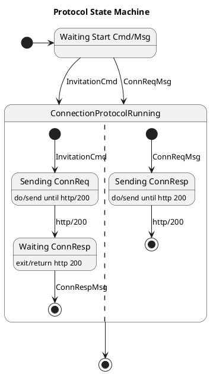

Since jumping on the OSS (Open Source Software) wagon, I have been learning new
things about software development and getting more evidence to do certain things
in a specific way.

Two of my favorite 'things' At the *code level* are **readability**
and **modifiability**. The latter is a very old friend of SW architecture's
quality attributes ([Software Architecture in Practice, Len Bass, et
al.](https://www.oreilly.com/library/view/software-architecture-in/9780132942799/)).
Still, it is not well aligned with the current *practices and tools* in the OSS scene
because everything is so text-centric. Practise has taught that software
architecture must be expressed in various notations; most are visual.

> [*"A picture is worth a thousand words"*](https://en.wikipedia.org/wiki/A_picture_is_worth_a_thousand_words)

Most of us can reason a well-grafted state-machine diagram must be faster
than a code written our favorite programming language. For instance, the next
state-machine diagram’s protocol implementation is constructed of thousands of
lines of code structured in multiple files that depend on external modules and
libraries. **We need abstraction layers and modules to manage all that complexity.**



Expressing things with the control-flow structures of imperative (or functional)
programming languages is more challenging—especially when the correctness of
the design should be verified. It seems that it’s easy to forget software
quality attributes during fast-phasing programming if we use tools that only
manage sequential text, i.e., code. At the code level, we should use functions
that give us an abstraction hierarchy and help us to maintain **modifiability**—and
readability as well, of course.

Moreover, since my studies of SW architecture’s quality attributes, I have
understood that modifiability is more than modularity, re-usability, or using
correct architectural styles like pipe and filter. Now we understand the importance of
[TTD](https://en.wikipedia.org/wiki/Test-driven_development), [continuous
deployment](https://en.wikipedia.org/wiki/Continuous_deployment),
[DevOps](https://en.wikipedia.org/wiki/DevOps), etc. These practices
don't work only on *one* of the engineering expertise. The best results are
achieved **through cross-area systems engineering practices**. 

> At NASA, “systems engineering” is defined as a methodical, multi-disciplinary
> approach for the design, realization, technical management, operations, and
> retirement of a system. — [NASA Systems engineering
> handbook](https://www.nasa.gov/wp-content/uploads/2018/09/nasa_systems_engineering_handbook_0.pdf)

In this post, I'll explain what multi-disciplinary software development
practices mean when your development is fast-phasing OSS.

## Code Modifiability

Most of the computer software is never ready. During its life cycle, it is under
continuous changes: new features are needed, bugs must be fixed, technical depth
need to be amortized, etc.

In modern OSS-based software development, modifiability can be thought of as
refactorability. Why? 

Because we want to follow The Boy Scouting Rule:

> *Always leave the code you are working on a little bit better than you found it.*

An excellent example of this rule is that when you **find a bug, before fixing
it to the mainstream, implement automatic tests to reproduce it**.

#### Refactorability

Go programming language is the most refactor-friendly of them all I have used.
1. integrated test harness 
1. benchmark tests
1. namespace and module integration
1. orthogonality
1. interface structure (no implementation declaration needed)
1. no `self` or `this` reserved words, you name object instances yourself
1. actual hybrid language combining OOP and needs functional programming features
   concentrating on simplicity
1. *batteries included* -standard library
1. type polymorphism, i.e., generics

I don't think that's even all of the features that help refactor your code, but
these are the fundamentals in the critical order.

Like any other programming language, Go isn't perfect yet. The current
error-handling mechanism and strict community with their 'idiomatic' language
policies restrict some of Go's refactoring capabilities. But you can avoid them
by using helper packages and your brains.

And, of course, there are two new language releases every year. Let's hope that
upcoming versions help us keep our Go projects refactorable and maybe even
help a little more.

## Code Readability

We want to maximize our **code’s readability**. One of the Go code’s problems is
that it overuses the if-statement, which prevents you from noticing the
algorithm's critical decision points.

For example, Go’s standard library includes quite many of the following code
blocks:

```go
func doSomething(p any, b []byte) {
    if p == nil {
        panic("input argument p cannot be nil")
    }
    if len(b) == 0 {
        panic("input argument p cannot be nil")
    }
    ...
    err := w.Close()
    if err != nil {
        log.Fatal(err)
    }
}
```

It’s easy to see that together with Go’s if-based error checking, these two hide
the happy path and make it difficult to follow the algorithm and skim the code.
The same thing can be found from Go’s unit tests if no 3rd party helper package
is used:

```go
     for _, tt := range tests {
          t.Run(tt.name, func(t *testing.T) {
               r := <-Open(tt.args.config, tt.args.credentials)
               if got := r.Err(); !reflect.DeepEqual(got, tt.want) {
                    t.Errorf("Open() = %v, want %v", got, tt.want)
               }
               w := r.Handle()
               if got := (<-Export(w, tt.args.exportCfg)).Err(); !reflect.DeepEqual(got, tt.want) {
                    t.Errorf("Export() = %v, want %v", got, tt.want)
               }
               if got := (<-Close(w)).Err(); !reflect.DeepEqual(got, tt.want) {
                    t.Errorf("Close() = %v, want %v", got, tt.want)
               }
          })
     }
```

The above code block is from a different test than the block below, but I think
you get the idea. I’m speaking fast skimming of code where simplicity and form
help a lot. Very much similar to syntax highlighting.

```go
func TestNewTimeFieldRFC3339(t *testing.T) {
     defer assert.PushTester(t)()

     var testMsg Basicmessage
     dto.FromJSON([]byte(timeJSONRFC3339), &testMsg)
     timeValue := testMsg.SentTime

     assert.INotNil(timeValue)
     assert.Equal(timeValue.Year(), 2022)
     assert.Equal(timeValue.Month(), time.September)
     assert.Equal(timeValue.Day(), 30)
}
```

That's clear and easy to skim. It's also straightforward to extend to use table
testing. I left it for the reader to figure out how that code renders without
an assert package.

## Conclusion

Go is built for hyper-large projects. Significant projects in every dimension:
software engineers, code lines, modules, function points, whatever. And it does
a pretty good job.

Unfortunately, the Go community isn't as open and welcoming as, for example,
Rust's community. (Not my words directly, but I share the opinion). Remember,
it's your code and your project to maintain. So, keep your head and remember:

> *The whole problem with the world is that fools and fanatics are certain of
> themselves, while wiser people are full of doubts.* — not entirely Bertrand
> Russell
