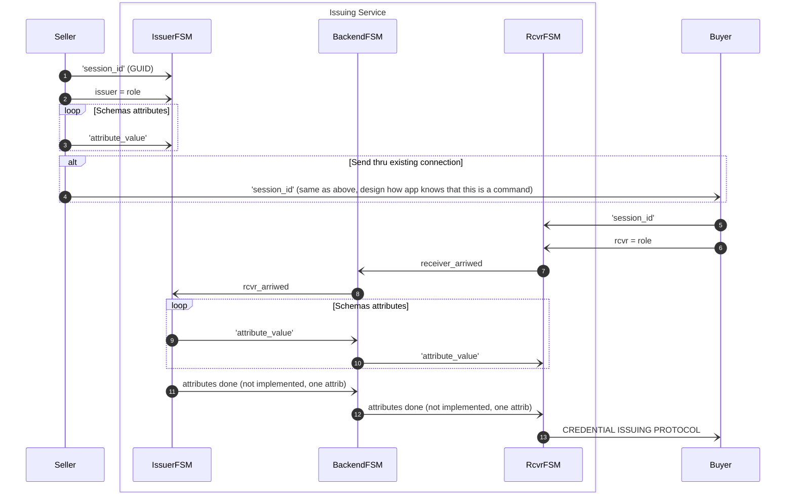

## Cryptographic evidence of transaction confirmation

The following table lists issues related to payment-specific information when
the current [WebAuthn](https://www.w3.org/TR/webauthn-3/) is used and how
[SPC](https://www.w3.org/TR/secure-payment-confirmation/) fixes these issues:

| Issue |          The Plain FIDO2/WebAuthn as TX Confirmation                               |    Fixes of Secure Payment Confirmation (SPC)                                         |
|-------|------------------------------------------------------------------------------------|---------------------------------------------------------------------------------------|
| 1     | It is a *misuse* of the challenge field (which is intended to defeat *replay attacks*). | The challenge field is only used to defeat *replay attacks*, as with plain [webauthn-3](https://www.w3.org/TR/webauthn-3/) |
| 2     | There is **no specification for payment challenge**, so each bank is likely to have to devise its own format for how payment specific information should be formatted and encoded in the challenge, complicating deployment and increasing fragmentation.     | **SPC specifies a format for payment-specific information.** This will enable development of generic verification code and test suites. | 
| 3     | Regulations may require **evidence that the user was shown and agreed to the payment-specific information**. Plain [webauthn-3] does not provide this challenge field. | SPC guarantees that the **user agent** has presented the **payment-specific information to the user** in a way that a **malicious website** (or maliciously introduced JavaScript code on a trusted website) **cannot bypass**.|

> **NOTE.** *Banks and other stakeholders in the payments ecosystem trust payments
> via browsers sufficiently today using TLS, iframes, and other Web features.
> The current specification is designed to increase the security and usability
> of Web payments* - [SPC](https://www.w3.org/TR/secure-payment-confirmation/)

## What Problem Do We Solve?


## Trust


## Privacy


*Issuing Service Chatbot*
<br/><br/>


### Helpers

1. Go to repo's root:
1. Shorter name and autocompletion:
   ```shell
   alias cli=findy-agent-cli
   source ./scripts/sa-compl.sh
   ```

> Document for now on assumes that CLI tool is named to `cli`.


## The Sequence Diagram




#### Pre-steps (not in the diagram)

#### Steps

## Conclusion


<br>
<div style="display: flex">
<span>

<div>Harri</div>
<div><a href="https://github.com/lainio/" target="_blank" rel="noopener noreferer"><i class="fab fa-github ml-2 "></i></a>
<a href="https://www.linkedin.com/in/harrilainio/" target="_blank" rel="noopener noreferer"><i class="fab fa-linkedin ml-2 "></i></a>
<a href="https://twitter.com/harrilainio" target="_blank" rel="noopener noreferer"><i class="fab fa-twitter ml-2 "></i></a></div>
</span></div>
